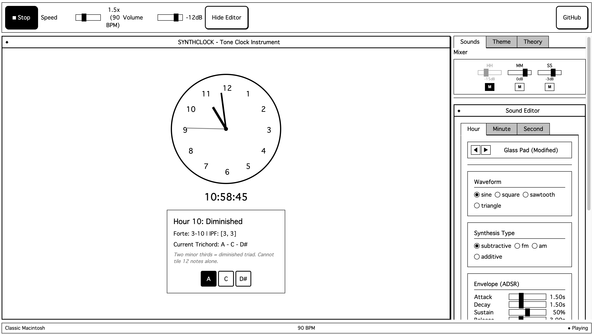

# SynthClock



Un instrumento musical generativo basado en el concepto del "Tone Clock" (Reloj Tonal).

## Descripción

SynthClock es una aplicación web interactiva que traduce el tiempo en música. Utiliza la teoría del Zodiaco Tonal para asignar tríadas musicales a las horas y genera melodías y ritmos basados en el paso del tiempo.

El proyecto combina una estética retro inspirada en interfaces clásicas (Macintosh, Terminal, BBS) con un motor de audio moderno basado en Tone.js.

## Características Principales

- **Tone Clock**: Visualización y sonificación de las horas basada en teoría musical avanzada.
- **Motor de Audio Polifónico**: Generación de sonido en tiempo real en el navegador.
- **Capas de Sonido**: Control independiente para:
  - **Hours**: Drones y texturas ambientales.
  - **Minutes**: Melodías y arpegios.
  - **Seconds**: Ritmos y pulsos.
- **Mixer Integrado**: Control de volumen y mute por canal.
- **Sound Editor**: Personalización profunda de cada sonido:
  - **Formas de Onda**: Sine, Square, Sawtooth, Triangle.
  - **Filtros**: Lowpass, Highpass, Bandpass, Notch.
  - **Efectos**: Reverb, Delay (con Feedback), Chorus, Distortion, Tremolo, Noise Gate.
- **Temas**: Interfaz personalizable con estéticas retro (Classic Mac, ANSI BBS, Terminal Green, Windows 3.1).

## Instalación y Ejecución

1. Clona este repositorio.
2. Navega al directorio de la aplicación:
   ```bash
   cd app
   ```
3. Instala las dependencias:
   ```bash
   npm install
   ```
4. Inicia el servidor de desarrollo:
   ```bash
   npm run dev
   ```
5. Abre `http://localhost:5173` en tu navegador.

## Personalización

### Agregar Nuevos Sonidos

Puedes crear tus propios presets de sintetizador editando el archivo `app/src/core/audio/presets.ts`.
Para una guía detallada, consulta [ADDING_SOUNDS.md](./ADDING_SOUNDS.md).

### Temas

Los temas visuales están definidos en `app/src/core/visuals/themes.ts`. Puedes modificar los colores y caracteres ASCII existentes o agregar nuevos temas siguiendo la estructura de tipos definida.

## Tecnologías

- **Frontend**: React, TypeScript, Vite
- **Audio**: Tone.js
- **Estado**: Zustand
- **Estilos**: CSS Modules / Vanilla CSS

## Licencia

Este proyecto es de código abierto. Siéntete libre de modificarlo y experimentar.